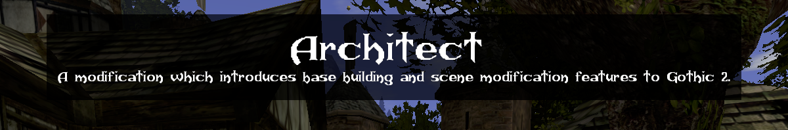
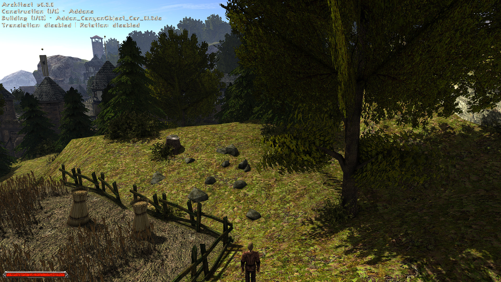
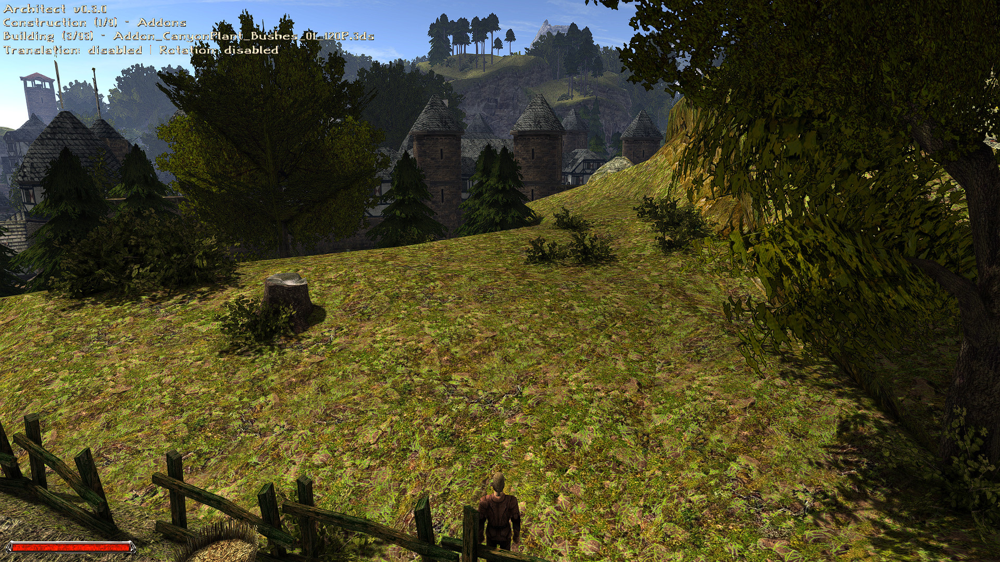
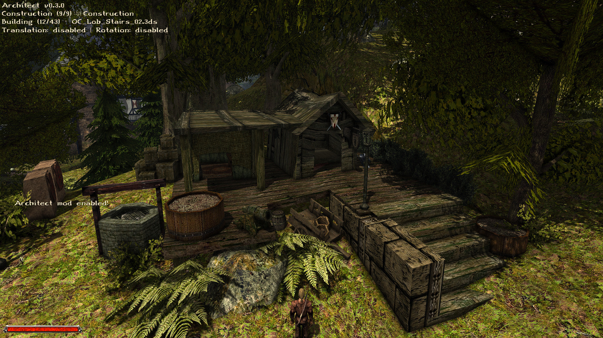
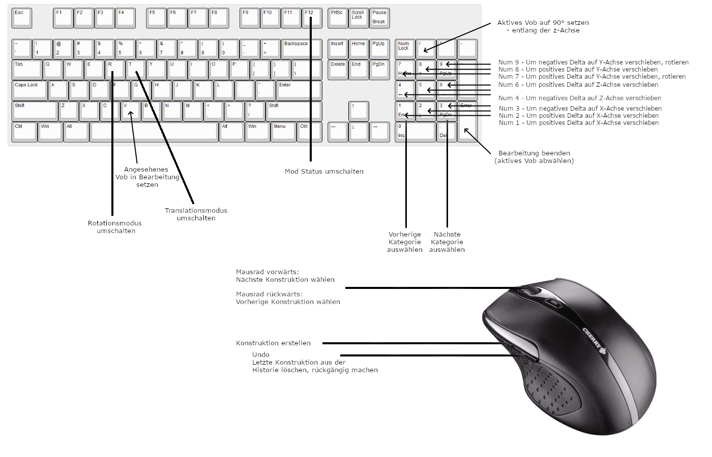

  

# Architect Mod
Eine Modifikation welche den Basis-Bau und Modifikation der Szene / Welt in Gothic 2 ermöglicht.

Was bedeutet das konkret? Ihr könnt euch bspw. einen beliebigen Punkt in einer Welt aussuchen und dort anhand eines Katalogs - Vobs mit bestimmten Visuals, sprich Modelle wie Planken in verschiedenen Maßen für Böden oder Wände, Möbel wie Betten, Tische, Schränke, etc., Vegetation wie Büsche, Bäume, Pflanzen, verschiedene Steine in der Welt platzieren. Dies geschieht in dem ihr mittels Mausrad eins der Models auswählt und dieses mittels Maus platziert - das wars - das Projekt ist dabei an das Settlement-Konzept aus Fallout 4 angelehnt. Man könnte sich das ganze das Projekt wie einen vereinfachten In-Game-Spacer der ausschließlich auf Daedalus basiert vorstellen .

Die Modifikation basiert in verschiedenen Bereichen auf Daedalus-Code-Snippets von anderen Autoren - diese habe ich in den jeweiligen Dateien explizit angegeben und am Ende der Readme nochmals erwähnt.    

## Features
 - Errichte beliebige Konstruktionen (.. Vobs) und greife dabei auf den Model-Vorrat aus G2 zurück
 - Greife auf verschiedene Kategorien von Konstruktion (.. Vobs) zurück - bspw. Natur, Constructions, AddOn, OldWorld, NewWorld, etc.
 - Bewege, Rotiere oder lösche neu erstellte oder bereits existierende Konstruktionen (.. Vobs)
 - Verwerfe alle aktuellen Änderungen mit der Undo-Historie
 - Die erzeugten Konstruktionen oder Modifikationen an der Welt sind persistent, d.h. eure Gebäude, Festungen oder sonstigen Änderungen sind auch beim nächsten Laden aktiv
 - Ninja-Support
 - ... 
 
## Screenshots
Im folgenden ein paar Screenshots um die Funktionalität vorzustellen.
  
  
  

## Anforderungen
- Gothic 2 (Ich verwende die Gold-Edition von Steam)
- Add-On: Die Nacht des Raben 
- [Ninja 2.5.09](https://github.com/szapp/Ninja/releases/tag/v2.5.09)

## Anforderungen - Standalone Installation
- [LeGo 2.7.1](https://github.com/Lehona/LeGo/releases/tag/v2.7.1)
- [Ikarus 1.2.2](https://github.com/Lehona/Ikarus/releases/tag/v1.2.2)

## Installation

### Ninja
- Bezieht ein beliebiges [https://github.com/benjaminfoo/Architect_G2/releases](Release)
- Entpackt die Architect.vdf.zip, kopiert die "Architect.vdf" in euer \Steam\steamapps\common\Gothic II\Data Verzeichnis zu all den anderen *.VDFs

### Standalone
- LeGo 2.7.1 beziehen und installieren
- Ikarus 1.2.2 beziehen und installieren
- Das Git-Repository clonen
- Den "Architect"-Ordner unter den Pfad \Steam\steamapps\common\Gothic II_work\Data\Scripts\Content kopieren, verschieben, etc.
- Die Methode "Architect_Init()" in INIT_GLOBAL() via Startup.d (\dev\Steam\steamapps\common\Gothic II_work\Data\Scripts\Content\Story\Startup.d) ausführen (muss noch von Hand eingetragen werden - ich werde noch einen Ninja-Patch für dieses Projekt erstellen)

## Nutzung / Eingabe
Die Nutzung des Projekts erfordert eine gewisse Einarbeitungszeit in die Verwendung der Shortcuts und Eingaben. \
Ich habe diese angelehnt an Programme wie Blender oder den Spacer gewählt. 

  

### Maus
- Mausrad vorwärts: Nächste Konstruktion wählen
- Mausrad rückwärts: Vorherige Konstruktion wählen
- Maus Seitentaste 1: Konstruktion erstellen
- Maus Seitentaste 2: Undo - Letzte Konstruktion aus der Historie löschen, erstellen rückgängig machen

### Tastatur - Keys
- F12: Mod Status umschalten
- T: Translationsmodus umschalten
- R: Rotationsmodus umschalten
- V: Angesehenes Vob in Bearbeitung setzen

### Tastatur - Numpad
- Numpad Division: Aktives Vob auf 90° setzen - entlang der z-Achse
- Numpad 9: Um negatives Delta auf Y-Achse verschieben, rotieren
- Numpad 8: Um positives Delta auf Y-Achse verschieben
- Numpad 7: Um positives Delta auf Y-Achse verschieben, rotieren
- Numpad 6: Um positives Delta auf Z-Achse verschieben
- Numpad 5: Kollision des aktiven (erstellten oder gewählten) Vobs togglen
- Numpad 4: Um negatives Delta auf Z-Achse verschieben
- Numpad 3: Um negatives Delta auf X-Achse verschieben
- Numpad 2: Um positives Delta auf X-Achse verschieben
- Numpad 1: Um positives Delta auf X-Achse verschieben
- Numpad Enter: Bearbeitung beenden (aktives Vob abwählen)

- Numpad 1: Vorherige Kategorie auswählen
- Numpad 3: Nächste Kategorie auswählen

#### Danke an:
- [Editing Community](https://forum.worldofplayers.de/forum/forums/104-Editing)
- [Lehona](https://github.com/Lehona/LeGo/) für die zahlreiche Beantwortung meiner Fragen :)
- [Mud-Freak](https://github.com/szapp/) für [Ninja](https://github.com/szapp/Ninja), [GFA](https://github.com/szapp/GothicFreeAim/) und eine nicht-aufzählbare Menge nützlicher Code-Snippets

#### Weiterführendes
- [Release-Thread im WOG](https://forum.worldofplayers.de/forum/threads/1575628-Release-Architect)
- [Ninja](https://forum.worldofplayers.de/forum/threads/1515286-Ninja)
- [ScriptBin](https://forum.worldofplayers.de/forum/threads/1495001-Scriptsammlung-ScriptBin)
- [Die stackbasierte VM Gothic](https://forum.worldofplayers.de/forum/threads/907096-WIP-Tutorial-Fortgeschritten-bis-Experten-Die-Gothic-dat-und-der-Datenstack)
- [Daedalus - Syntax](https://www.worldofgothic.de/modifikation/index.php?go=daedalus)
- [Gothic - Wiki](https://wiki.worldofgothic.de/doku.php)
- [Gothic - Externals](https://www.worldofgothic.de/modifikation/index.php?go=g2functions)

