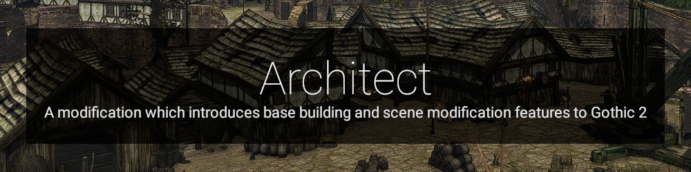

  

# Architect Mod
Eine Modifikation welche den Basis-Bau und Modifikation der Szene / Welt in Gothic 2 einführt. \

Die Modifikation basiert in verschiedenen Bereichen auf Daedalus-Code-Snippets von anderen Autoren - diese habe ich in den jeweiligen Dateien explizit angegeben und am Ende der Readme nochmals erwähnt.

## Features
- Errichte beliebige Konstruktionen (.. Vobs) und greife dabei auf den Model-Vorrat aus G2 zurück
- Greife auf verschiedene Kategorien von Konstruktion (.. Vobs) zurück - bspw. Natur, Constructions, AddOn, OldWorld, NewWorld, etc. 
- Bewege, Rotiere oder lösche neu erstellte oder bereits existierende Konstruktionen (.. Vobs)
- Verwerfe alle aktuellen Änderungen mit der Undo-Historie
- ...

## Requirements
- Gothic 2 
- Add-On: Die Nacht des Raben
- [LeGo 2.7.1](https://github.com/Lehona/LeGo/releases/tag/v2.7.1)
- [Ikarus 1.2.2](https://github.com/Lehona/Ikarus/releases/tag/v1.2.2)

## Installation
- Include this file within the Gothic.src file
 - like this: ArchitectMod\architect_mod.d <|> in the file: <root>\Steam\steamapps\common\Gothic II\_work\Data\Scripts\Content
- Execute the Architect_Init() method in INIT_GLOBAL() via Startup.d within <root>\dev\Steam\steamapps\common\Gothic II\_work\Data\Scripts\Content\Story\Startup.d

## Nutzung / Eingabe
Die Nutzung des Projekts erfordert eine gewisse Einarbeitungszeit in die Verwendung der Shortcuts und Eingaben. \
Ich habe diese angelehnt an Programme wie Blender oder den Spacer gewählt. \

  

### Maus
- Mausrad vorwärts: Nächste Konstruktion wählen
- Mausrad rückwärts: Vorherige Konstruktion wählen
- Maus Seitentaste 1: Konstruktion erstellen
- Maus Seitentaste 2: Undo - Letzte Konstruktion aus der Historie löschen, erstellen rückgängig machen

### Tastatur 

#### Reguläre Tasten
- F12: Mod Status umschalten
- T: Translationsmodus umschalten
- R: Rotationsmodus umschalten
- V: Angesehenes Vob in Bearbeitung setzen

#### Numpad
- Numpad Division: Aktives Vob auf 90° setzen - entlang der z-Achse
- Numpad 9: Um negatives Delta auf Y-Achse verschieben, rotieren
- Numpad 8: Um positives Delta auf Y-Achse verschieben
- Numpad 7: Um positives Delta auf Y-Achse verschieben, rotieren
- Numpad 6: Um positives Delta auf Z-Achse verschieben
- Numpad 4: Um negatives Delta auf Z-Achse verschieben
- Numpad 3: Um negatives Delta auf X-Achse verschieben
- Numpad 2: Um positives Delta auf X-Achse verschieben
- Numpad 1: Um positives Delta auf X-Achse verschieben
- Numpad Enter: Bearbeitung beenden (aktives Vob abwählen)
- Numpad 1: Vorherige Kategorie auswählen
- Numpad 3: Nächste Kategorie auswählen

#### Danke an:
- [Editing Community](https://forum.worldofplayers.de/forum/forums/104-Editing)
- [Lehona](https://github.com/Lehona/LeGo/) für die zahlreiche Beantwortung meiner Fragen :)
- [Mud-Freak](https://github.com/szapp/) für [Ninja](https://github.com/szapp/Ninja), [GFA](https://github.com/szapp/GothicFreeAim/) und eine nicht-aufzählbare Menge nützlicher Code-Snippets

#### Weiterführendes
- [Ninja](https://forum.worldofplayers.de/forum/threads/1515286-Ninja)
- [ScriptBin](https://forum.worldofplayers.de/forum/threads/1495001-Scriptsammlung-ScriptBin)
- [Die stackbasierte VM Gothic](https://forum.worldofplayers.de/forum/threads/907096-WIP-Tutorial-Fortgeschritten-bis-Experten-Die-Gothic-dat-und-der-Datenstack)
- [Daedalus - Syntax](https://www.worldofgothic.de/modifikation/index.php?go=daedalus)
- [Gothic - Wiki](https://wiki.worldofgothic.de/doku.php)
- [Gothic - Externals](https://www.worldofgothic.de/modifikation/index.php?go=g2functions)
